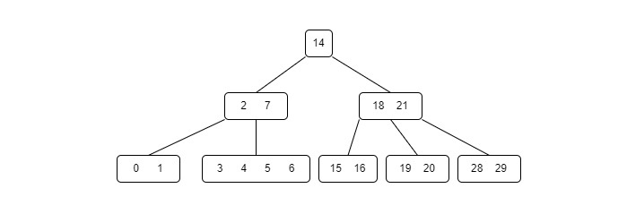

# 🌳 README – Implementação de Árvore 2-3 em Java

<div align="center">
  
</div>

## 📌 O que é uma Árvore 2-3?

A árvore **2-3** é uma **árvore de busca balanceada** que garante que todas as operações básicas (inserção, busca, remoção) ocorram em tempo logarítmico. Ela é um tipo de **árvore multiway** onde:

- Cada **nó** pode ter **1 ou 2 chaves**.
- Consequentemente, pode ter **2 ou 3 filhos**.
- Todas as **folhas estão no mesmo nível**, o que garante o balanceamento da árvore.

### Tipos de nós:

- **2-nó**: possui 1 chave e 2 filhos.
- **3-nó**: possui 2 chaves e 3 filhos.

---

## 🔧 Estrutura do Código

O código está dividido em duas classes principais:

### `No23`
Classe que representa um nó da árvore:
- `chave1`, `chave2`: valores armazenados.
- `esquerda`, `meio`, `direita`: filhos do nó.
- `ehFolha`: define se o nó é folha.
- Métodos auxiliares: `ehNo2()` e `ehNo3()`.

### `Arvore23`
Classe da árvore:
- `inserir()`: insere valores na árvore, fazendo divisões quando necessário.
- `buscar()`: busca um valor na árvore.
- `remover()`: remove valores, aplicando rebalanceamento se necessário.
- `printInOrdem()`: imprime a árvore em ordem crescente.

---

## ▶️ Exemplo de Execução

A classe `Main` já inclui exemplos práticos de todas as operações:

```java
int[] valores = {10, 20, 5, 6, 12, 30, 7, 17};
for (int valor : valores) {
    arvore.inserir(valor);
}
```

```java
int[] buscas = {5, 10, 15, 30};
for (int valor : buscas) {
    arvore.buscar(valor);
}
```

```java
int[] remover = {6, 10, 12};
for (int valor : remover) {
    arvore.remover(valor);
}
```

---

## ⚙️ Como Compilar e Executar

1. Salve os arquivos `Main.java`, `Arvore23.java` e `No23.java` (ou todos em um único `.java` se preferir).
2. Compile no terminal:
   ```bash
   javac Main.java
   ```
3. Execute:
   ```bash
   java Main
   ```

---

## ✅ Funcionalidades Implementadas

- [x] Inserção com divisão de nós
- [x] Busca com recursão
- [x] Remoção com rebalanceamento
- [x] Impressão em ordem
- [x] Estrutura 100% balanceada
